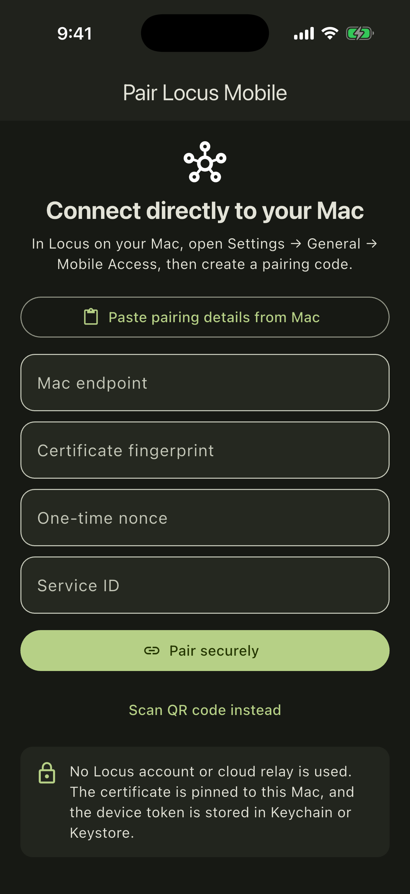

# Locus Mobile

Private iOS and Android companion for [Locus on macOS](https://github.com/nahid-sparktales/locus).



Locus Mobile pairs directly with your Mac over the local network. A user-managed
Tailscale address can be saved for access away from home without a Locus account,
hosted service, or relay. The phone pins the Mac certificate from the five-minute,
one-use pairing code, and its device token stays in iOS Keychain or Android
Keystore.

## Capabilities

- View, create, and continue durable chats in saved Mac workspaces
- Choose Ask, Work, Plan, or Build mode for new mobile chats
- Follow streaming responses and running activity
- Stop runs and answer one-time permission or plan approvals
- View schedules, run them now, and pause or resume them
- Reconnect through Bonjour, saved LAN endpoints, or optional Tailscale addresses

Terminal, browser, file editing, provider and account settings, permanent
permissions, worktree landing, attachments, destructive session actions, and an
offline command queue remain desktop-only.

## Security model

Mobile Access is disabled by default in the Mac app. Pairing exchanges a one-use
nonce for a revocable device token over a pinned TLS connection. The Mac stores
only token hashes and sanitized device metadata. System prompts, credentials,
environment variables, hidden tool results, and unrelated files are never part
of the mobile protocol.

## Development

```sh
flutter pub get
flutter analyze
flutter test
flutter run
```

Use the Mobile Access section in Locus Settings on the Mac to enable the TLS
gateway and create a five-minute pairing code.

The shared protocol examples used by tests live in
[`fixtures/companion-v1.json`](fixtures/companion-v1.json).

## License

Licensed under the [Apache License 2.0](LICENSE), © 2026 SparkTales Inc.
